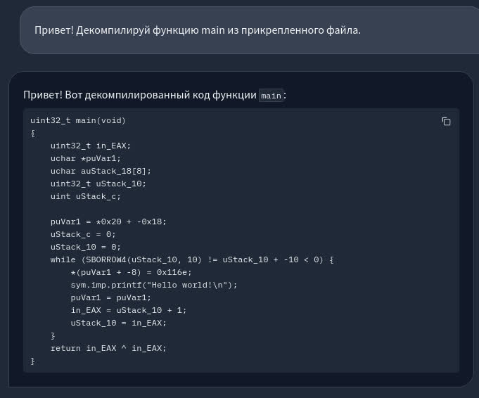

<div align="center">
<h1>Gigampiler</h1>
<a href="https://opensource.org/licenses/MIT)"></a>



</div>

Данный ИИ ассистент, основанный на GigaChat, создан, чтобы помочь начинающим специалистам по кибербезопасности декомпилировать файлы.

## Установка и запуск

```sh
$ docker build -t gigampiler .
$ docker run -p 127.0.0.1:7860:7860 gigampiler
```
